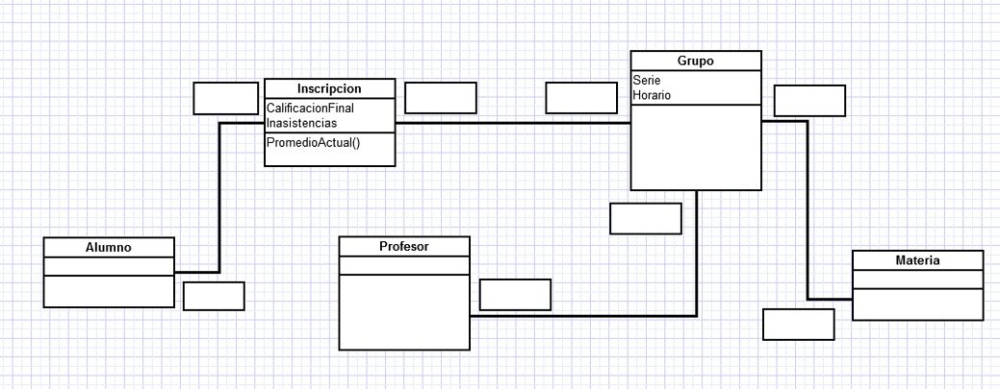
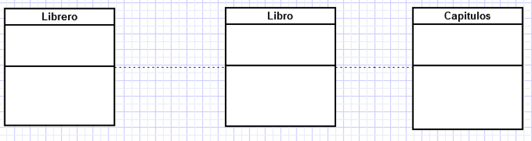

# Tareas de Programación Orientada a Objetos

# Unidad 1: El Paradigma Orientado a Objetos

## UML

1.	Agrega la cardinalidad o multiplicidad para las asociaciones del siguiente diagrama de clases, justifica tus decisiones:



2. Completa los tipos de asociación (Agregación y Composición) y multiplicidad que hay entre las clases siguientes y explica porque es de ese tipo.



3. Haz el diagrama de clases del siguiente sistema:
```
Nos piden hacer una aplicación para llevar una bitácora de libros
que estamos leyendo y los que ya terminamos de leer. 
En la App podemos buscar libros por autor, categoría, título y calificación.
Una vez que encontramos un libro, podemos agregarlo a nuestra biblioteca e indicar
si lo estamos leyendo o ya terminamos de leer. También le podemos poner una calificación.
Los libros pueden tener más de un autor, si buscamos un autor podemos ver la
lista de los libros que ha escrito. En caso de que haya traducciones o reediciones 
se consideran como el mismo libro. 

OPCIONAL: Podemos indicar si un libro se lo prestamos a un amigo, desde que fecha y
tenemos su contacto para recordarle que nos lo regrese.
```

# Unidad 2: Clases y Objetos
## Programa básico Películas 

De acuerdo a los ejemplos vistos en clase y la lectura. Implementa en c# la
clase *Pelicula*  con los siguientes atributos **públicos**:

### Pelicula
| atributo             | tipo           |
| ---------------------|----------------|
| titulo               | String         |
| año                  | Int16          |
| país                 | String         |
| director             | String         |


1. Como primer paso crea solo la clase con los atributos públicos e
   inicializalos en **Program.Main()** directamente.
2. Crea dos objetos tipo Pelicula con dos peliculas ganadoras de un Oscar. 
3. Ahora modifica el programa para que imprima en la consola el titulo y año de las peliculas. 
   Para esto, agrega un método llamado Imprime() a la clase Pelicula.
   Sube la primera versión a GitHub.
4. Ahora cambia los atributos a **private**. Agrega los métodos necesarios para
   crear los objetos y acceder a los atributos (campos en C#) de la siguiente manera:

```csharp
class Program 
{
static void Main(){

    Pelicula p1 = new Pelicula();
    p1.SetTitulo("La La Land");
    p1.SetAño(2016); 
    Console.WriteLine("{0}({1})", p1.GetTitulo(), p1.GetAño());
}
} 
```
   Sube esta nueva versión a GitHub.

5. Por último agrega dos constructores sobrecargados: *Pelicula()* y
   *Pelicula(string titulo, Int16 año )*. Actualiza la
   versión a GitHub.


## Lista de Películas 

Utilizando la bibliteca *System.Collections.Generic* crea una lista de 5 peliculas. Utilizando la lista genérica **List<Pelicula>**.
1. Crea la lista en *Main()* y agrega directamente las peliculas a la lista, por ejemplo para la clase **Persona** sería de esta manera (fragmento):

```csharp
List<Persona> personas = new List<Persona>();

persona.Add(new Persona ("pam"));
persona.Add(new Persona ("tom"));
persona.Add(new Persona ("jim"));

```
2. Utiliza un ciclo **foreach** para iterar por la lista e imprimir las peliculas.

## Actores 
Agrega a tu clase **Pelicula** un atributo **actores** de tipo **List<Actor>**
Tu clase debe permitir el siguiente funcionamiento:

```csharp
class Program 
{
static void Main(){

    Pelicula p1 = new Pelicula("La La Land", 2016);
    p1.AgregarActor(new Actor("Ryan Gosling", 1980));
    p1.AgregarActor(new Actor("Emma Stone", 1988));

    p1.ImprimeActores();

}
} 
```

## Paso de parámetros  
1. Lee el texto de [pase de parametros](../clases/params.md).
1. Escribe un programa en el cual ejemplifiques el paso de parámetros
**por valor** y **por referencia** utilizando los modificadores **ref**, **out** e **in**.

## Sobrecargado de Operadores
### Dominó
Implementa la clase **Domino** siguiendo los pasos:

1. Declara la clase **Domino** con los atributos: *Espacio1* y *Espacio2*.
2. Sobrecarga el operador **+** para que puedas sumar dos objetos tipo **Domino**.
El resultado debe ser un entero, con la suma de los puntos de ambas piezas.

### Duración
Implementa la clase **Duración** siguiendo los pasos:
1. Declara la clase **Duración** con los atributos: *horas*, *minutos* y *segundos*. Estos atributos puden ser propiedades. Por ejemplo, pudes guardar todo en segundos y calcular como paramentres las *horas* y *minutos*. Implementa un método para imprimir la duración en el formato *HH:MM:SS*.
2. Sobrecarga el constructor **Duración(int h, int m, int s)**.
2. Sobrecarga el constructor **Duración(int segundos)**. Dependiendo de la implementación del paso 1, puede ser que debas extraer las horas y los minutos.
3. Sobrecarga el operador **+** para que puedas sumar dos objetos tipo **Duración**. 


# Unidad 3: Herencia
## Alumnos
Debes hacer un programa dónde utilices la siguiente jerarquía de clases: **Alumno**, **Licenciatura**,
y **Posgrado**. La diferencia entre un alumno de Licenciatura y de Posgrado es que los alumnos de 
Licenciatrua hacen servicio social y residencias, y el alumno de posgrado tiene un tema de investigación.
Debes:

1. Utilizar herencia. 
2. Utilizar la referencia **base** y miembros de la clase base.
3. Redefinir un método en la clase derivada utilizando el modificador **new**.
4. Prueba la diferencia entre **private** y **protected** para los campos de la clase **Alumno**.

## Músicos
Escribe un programa dónde utilices la siguiente jerarquía de clases: **Músico**, **Baterista**,
**Bajista** y **Guitarrista**. En el método **Main()** debes crear una lista de músicos 
(**List<Músico>**) y utilizando métodos **virtuales** hacer que los músicos ejecuten los métodos:
**afina()**,**saluda()**,**toca()**. Básate en el ejemplo que vimos en clase. Importante: 
no debes utilizar clases abstractas ni interfaces.


# Unidad 4: Polimorfismo
## Clases Abstractas  

### Músicos Abstractos 
Implementa el programa de **Músico** que hiciste en el tema de Herencia pero con clases abstractas.
Los métodos Saluda(), Afina(), Toca() ahora deben ser **abstract**.

### Ilustrador
Basándote en el programa a continuación, terminalo pero  
utilizando el concepto de clases abstractas.

```csharp
using System;
using System.Collections.Generic;

namespace figura
{
    class Figura 
    {
        protected int x;
        protected int y;
        protected string color;

        public Figura(int x, int y, string c){
            this.x = x; this.y = y; color = c;
        }

        public void dibuja()
        {
            Console.WriteLine("Se dibuja una figura color {0}", 
            color);
        }

        public void printColor() {
            Console.WriteLine(color);
        }
    }

    class Circulo : Figura {
        public Circulo(int x, int y, string c):base(x , y, c){
        }

        public new void dibuja(){
            Console.WriteLine("Se dibuja un circulo {0}", color);
        }
    }

    class Rect : Figura {
        public Rect(int x, int y, string c):base(x , y, c){
            }
        }
    class Program{
        static void Main(string[] args){
            List<Figura> figuras = new List<Figura>();
            figuras.Add(new Circulo(12,13,"verde")) ;
            figuras.Add(new Rect(12,13,"azul")) ;
            figuras.Add(new Rect(12,13,"rojo")) ;
            figuras.Add(new Circulo(12,13,"rojo")) ;
            foreach (var item in figuras){
                item.dibuja();
            }    
            Circulo r = new Circulo(10,10,"rojo");   
            r.dibuja();
            }
        }
}
```

## Interfaces 
Debes hacer que tu clase abstracta **Figura** implemente la interfaz **IComparable** como vimos en clase. 
En este caso las figuras se van a comparar por su area. Para esto debes agregar el método 
abastracto **public abstract decimal Área()** a la clase Figura. Ya con el método implementado 
en las clases derivadas, ahora si, compara las áreas e implementa el método **CompareTo**. 
[Aquí esta la documentación de IComparable](https://learn.microsoft.com/es-mx/dotnet/api/system.icomparable?view=net-6.0).


## Generics 
### Stack
Implementa la clase **genérica** Stack<T>, la cual sea eso una Pila. Debe
incluir los métodos push() y pop() y debe lanzar una excepción en caso de que
la pila se desborde o se intente hacer pop() a una pila vacía. Básate en el
ejercicio visto en clase. Prueba tu clase con varios tipos de datos.


### Cola 
*Reto Adicional OPCIONAL:*

Utilizando las ideas vistas en la clase **Stack\<T\>** ahora intenta hacer
una Cola. La cola funciona como una estructura FIFO (First In, First Out),
es decir, el primero que entra es el primero que sale. Puedes utilizar un arreglo y recorrer los
elementos como en una fila del mundo real. A diferencia de la Pila, ahora necesitamos 
dos apuntadores, uno que nos indica dónde esta el inicio de la fila (el último que se formó)
y otro que indique quien es el que sigue en el turno. Los métodos ahora son **EnQueue** y 
**DeQueue()**.


# Unidad 5: Excepciones
En la tarea de la Unidad 6, debes agregar las excepciones necesarias, por ejemplo
cuando el archivo que deseamos abrir no exista. También cuando haya algún error 
en el procesamiento del archivo.

# Unidad 6: Archivos

Crea una clase llamada **Producto** y otra **ProductoDB** la cual lea y escriba
objetos tipo **Producto** a un archivo, similar a lo visto en clase. Debes de
atrapar las posibles excepciones, como se vió en clase. 

La clase **Producto** debe tener los siguientes atributos:

| atributo             | tipo           |
| ---------------------|----------------|
| Código               | String         |
| Descripción          | Decimal        |
| Departamento         | Int            |
| Likes                | Int            |
| Precio               | Decimal        |

1. Debes guardar los datos en un archivo tipo TEXTO.
2. También en un archivo tipo BINARIO.
3. Haz un método llamado GetDepartment(int Depto) que lea los productos del
   archivo, pero muestre en pantalla solo los productos de un departamento.
   Digamos filtra los productos por departamento.
4. Haz un método que lea los **Productos** de un archivo y los ordene por Likes,
   después los muestre en la consola. Para esto puedes utilizar el método de interfaces
   o investigar otros métodos como Delegados o LINQ, si es así, debes poder explicar su 
   funcionamiento.
5. Escibe otro programa que agregue (Append) los productos de un archivo a otro archivo 
   ya existente.
